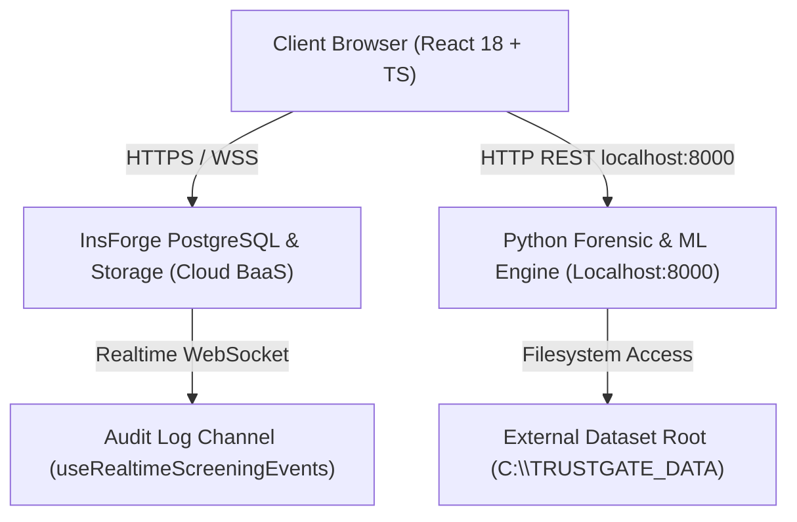

# TRUSTGATE AI BILLION — ENGINEERING BASELINE & ROOT CAUSE AUDIT
**Document Reference**: `AUDIT_ROOT_CAUSE.md`  
**Classification**: High-Assurance National Security / Border Screening Architectural Baseline  
**National Border Security Standard**: Border Gateway Standard — AI-Based Fake Identity & Document Screening System  
**Audit Timestamp**: 2026-09-05T23:15:00Z  
**Principal Engineers**: Principal Architect, Computer Vision, Security, ML, Backend & QA Systems  

---

## 1. Architectural Overview & System Topology

TRUSTGATE AI BILLION is structured as a zero-trust, multi-tier defense architecture designed for immigration checkpoints, e-gates, and secondary border inspection terminals. The system consists of four primary runtime tiers:

1. **Frontend Presentation & Screening Tier (Vite + React 18 + TypeScript + TailwindCSS 3.4)**
   - **Border Screening Gateway**: `/sih-screening` (`SihScreeningDashboard.tsx`), an operational 7-screen border workflow with an integrated Unified Command Hub (Screen 0).
   - **Deep Forensic Pipeline**: `/screening` (`ScreeningPage.tsx`), a 9-stage modular inspection workbench.
   - **Enterprise Backoffice**: Case management (`/cases`, `/cases/:id`), reports (`/reports`), analytics (`/analytics`), model inspection (`/models`), dataset management (`/datasets`), and administration (`/admin/*`).
   - **State Machine Core**: `ScreeningContext` (`src/providers/ScreeningContext.tsx`) maintaining cryptographic session isolation and single-source-of-truth invariants across all UI views.

2. **Backend BaaS & Identity Tier (InsForge PostgreSQL & PostgREST)**
   - Hosted at `https://heicn84u.us-east.insforge.app`.
   - 26 relational tables governing identity cases, uploaded documents, OCR fields, MRZ extractions, ELA tampering results, face biometric verifications, risk scores, findings, audit trails, and role assignments.
   - Row-Level Security (RLS) enforcing tenant isolation, role-based access control, and ownership checks.
   - S3-compatible private document storage bucket: `screening-documents`.

3. **High-Performance Python Forensic & ML Verification Engine (FastAPI / HTTP on Port 8000)**
   - `midv_llm_engine/server.py` and `midv_llm_engine/llm_verifier.py`.
   - Executes deep optical archetype conformity verification against MIDV-2020 and MIDV-500 specifications.
   - Neural classification using `TrustGateForensicNet` and `TrustGateFusionNet` weights.
   - Biometric face spoof / deepfake evaluation via `FaceForensicsEngine`.
   - ICAO 9303 checksum validation via `MrzValidator`.

4. **External Dataset & Model Training Root (`C:\TRUSTGATE_DATA`)**
   - Strictly isolated from repository code (`.gitignore` + external path).
   - Partitioned into `raw/`, `processed/`, `manifests/`, `splits/`, `models/`, and `evaluation/`.
   - Enforces physical document-level disjoint splitting (`document_disjoint_split.json`) to guarantee zero train-test identity leakage.



---

## 2. Application Entry Points & Bootstrapping

- **Entry Point**: `src/main.tsx`
  - Mounts React 18 root onto DOM element `#root`.
  - Configures `QueryClient` with `staleTime: 30_000`, `refetchOnWindowFocus: false`, `retry: 1`.
  - Wraps application tree in hierarchical providers:
    1. `QueryClientProvider`
    2. `BrowserRouter`
    3. `ThemeProvider` (dark/light terminal mode)
    4. `AuthProvider` (InsForge session, user role, access approval gate)
    5. `ScreeningProvider` (`ScreeningContext` handling `PRODUCTION` vs `DEMO` state, cryptographic document hash, and run ID)
    6. `SecurityErrorBoundary` (catches rendering and cryptographic assertion exceptions)
    7. `AppRouter` (`src/router/index.tsx`)

- **Router Hierarchy (`src/router/index.tsx`)**:
  - **Public**: `/` (`LandingPage.tsx`)
  - **Access Gate**: `/authorization-gate` (`AuthorizationGatePage.tsx` for pending members awaiting admin clearance)
  - **Unauthenticated Flow**: `/login`, `/register`, `/forgot-password`, `/reset-password` (redirects to `/dashboard` if logged in)
  - **Protected Shell (`AppShell`)**:
    - Core: `/dashboard`, `/screening`, `/sih-screening`, `/cases`, `/cases/:id`, `/reports`, `/settings`
    - Intelligence: `/analytics`, `/audit`, `/models`, `/datasets`
    - Administration: `/security`, `/admin`, `/admin/users`, `/admin/authorizations`
    - Error boundaries: `/access-denied`, `*` (`NotFoundPage`)

---

## 3. Database Architecture & PostgREST / InsForge Schema

The InsForge backend contains 26 PostgreSQL tables with relational integrity:

| Table Name | Records | Purpose | Relational Parent |
| :--- | :--- | :--- | :--- |
| `cases` | 17 | Core border screening case container | Root entity (`created_by -> auth.users`) |
| `documents` | 7 | Ingested physical/digital travel credentials | `cases.id` (ON DELETE CASCADE) |
| `document_images` | 0 | Multi-spectral crop artifacts | `documents.id` |
| `ocr_results` | 6 | High-level OCR execution metadata | `documents.id` |
| `ocr_fields` | 48 | Granular field-level extractions & confidence | `ocr_results.id` |
| `mrz_results` | 6 | ICAO 9303 line extractions & check digits | `documents.id` |
| `tampering_results` | 6 | ELA, copy-move, and splice detection scores | `documents.id` |
| `tampering_regions` | 0 | Bounding boxes of localized pixel anomalies | `tampering_results.id` |
| `face_results` | 6 | Biometric match, liveness, and deepfake metrics | `documents.id` |
| `face_embeddings_metadata` | 0 | Cryptographic hashes of facial embeddings | `face_results.id` |
| `risk_scores` | 16 | Multi-signal fusion risk calculations | `cases.id` |
| `risk_factors` | 54 | Granular weights contributing to risk score | `risk_scores.id` |
| `validation_results` | 42 | Rule engine pass/fail assertions | `cases.id` |
| `findings` | 63 | Officer investigation findings & notes | `cases.id` |
| `reports` | 5 | Generated border intelligence dossiers | `cases.id` |
| `audit_logs` | 24 | Immutable append-only tamper-evident event log | `actor_id -> auth.users` |
| `profiles` | 9 | Extended officer profiles & status | `id -> auth.users.id` |
| `roles` | 4 | System roles (`officer`, `supervisor`, `admin`, `analyst`) | Lookup |
| `user_roles` | 9 | User-to-role mappings | `user_id -> auth.users.id` |
| `member_access_requests` | 3 | Self-registration approval requests | Standalone |
| `model_versions` | 8 | Active AI model registry in database | Standalone |
| `model_metrics` | 0 | Benchmarking accuracy/F1 logs | `model_versions.id` |
| `notifications` | 4 | User notifications | `user_id -> auth.users.id` |
| `settings` | 6 | Global system configuration parameters | Standalone |
| `security_events` | 0 | Security violations and WAF anomalies | Standalone |
| `system_events` | 0 | Heartbeats and health checks | Standalone |

---

## 4. Authentication, Session Management & RBAC Flows

- **Authentication Mechanism**:
  - Managed via `@insforge/sdk` (`insforge.auth.signInWithPassword`, `signOut`, `signUp`).
  - Session tokens stored in memory and local storage under InsForge token management.
  - State managed via Zustand store (`useAuthStore` in `src/providers/AuthProvider.tsx`).

- **Role Hierarchy & Permissions**:
  - `admin`: Superuser access (`users:manage`, `system:manage`, `security:view`, `models:manage`, `datasets:manage`, plus all operational permissions).
  - `supervisor`: Senior border officer (`cases:review`, `cases:approve`, `cases:risk_override`, `audit:view`, `reports:generate`, etc.).
  - `officer`: Screening officer (`cases:create`, `cases:view_assigned`, `documents:upload`).
  - `analyst`: Read-only intelligence officer (`analytics:view`, `models:inspect`, `datasets:review`).
  - `pending`: Registered officer awaiting administrator authorization.

- **Gate Enforcement**:
  - Client-side: `ProtectedRoute` in `src/router/index.tsx` verifies `isAuthenticated`, `user.status !== "pending"`, `roleAtLeast()`, and `hasPermission()`.
  - Server-side: PostgreSQL Row-Level Security checks `auth.uid()` and database functions `is_admin()`, `is_supervisor_or_admin()`, and `current_app_role()`.

---

## 5. API Integration & Realtime Event Flows

- **PostgREST Client (`src/lib/insforge.ts` & `src/lib/db.ts`)**:
  - Type-safe queries using `@insforge/sdk`.
  - Ingestion calls write simultaneously to `cases`, `documents`, `audit_logs`, `ocr_results`, `mrz_results`, `tampering_results`, `face_results`, `risk_scores`, and `reports`.
  - Offline sync: `src/lib/offlineDb.ts` uses IndexedDB to buffer writes when network connectivity is interrupted.

- **Realtime Pub/Sub WebSocket Architecture**:
  - Subscribes to table change events on `audit_logs` using `insforge.realtime`.
  - Encapsulated in `useRealtimeScreeningEvents` (`src/hooks/useRealtimeScreeningEvents.ts`).
  - Filters strictly by `processingRunId` and `documentHash`.
  - Maintains `Set<string>` of event IDs to prevent duplicate rendering.

- **Local Python Engine Communication (`src/lib/midvService.ts`)**:
  - Communicates with `http://localhost:8000`.
  - Endpoints: `POST /verify`, `POST /faceforensics/verify`, `GET /dataset/archetypes`, `GET /faceforensics/metadata`, `GET /health`.
  - Fallback logic: If Python engine is unreachable, client-side TypeScript pipeline (`src/ai/pipeline/orchestrator.ts`) performs pure in-browser client evaluation with explicit degradation warning: `[DEGRADED MODE] Python LLM Engine offline`.

---

## 6. Storage Architecture & Storage RLS Policies

- **Bucket**: `screening-documents`
  - Privacy: **Private** (`public: false`).
  - Access Pattern: Secure authenticated download via `insforge.storage.from("screening-documents").download(path)`.
  - Blob Object URLs: Converted to ephemeral `URL.createObjectURL(blob)` and automatically revoked on component unmount to prevent memory leaks and browser cache exposure.
- **Audit Finding on Storage RLS**:
  - Direct public URL access is blocked.
  - Ephemeral object URLs are cleaned up correctly in `DocumentViewer.tsx`.

---

## 7. AI / ML Model Pipeline Flow & Cryptographic Provenance

The forensic pipeline adheres to a strict 9-stage sequence:

```mermaid
flowchart LR
    S1[01 Image Quality] --> S2[02 Doc Detect]
    S2 --> S3[03 OCR Extraction]
    S3 --> S4[04 MRZ Parsing]
    S4 --> S5[05 Cross-Validation]
    S5 --> S6[06 Tamper ELA Analysis]
    S6 --> S7[07 Facial Forensics]
    S7 --> S8[08 Identity Resolution]
    S8 --> S9[09 Multi-Signal Risk Fusion]
```



- **Cryptographic Provenance Invariants**:
  - Every document ingested is hashed via deterministic Web Crypto API `crypto.subtle.digest("SHA-256", buffer)`.
  - Ingestion generates an immutable tuple: `(caseId, documentId, processingRunId, documentHash, captureSource)`.
  - Every subsequent pipeline stage result, database record, and audit log event is stamped with this exact tuple.
  - Concurrency Guard: An asynchronous `activeRunIdRef` check verifies that if a new document is uploaded before an existing run finishes, the older run's results are discarded immediately.

---

## 8. Security Controls & Defense-in-Depth Boundaries

1. **Security Error Boundary**:
   - `SecurityErrorBoundary` (`src/components/common/SecurityErrorBoundary.tsx`) wraps the application router. Intercepts runtime exceptions, clears sensitive cryptographic material from memory, logs security events, and presents an officer recovery prompt.
2. **Input Validation & Sanitization**:
   - `src/lib/security.ts`: `sanitizeInput()`, `sanitizeObject()`, and `validateCaseCode()`.
   - Prevents XSS, SQL injection, and path traversal across user inputs and file metadata.
3. **HTTP Security Headers**:
   - Python FastAPI server implements strict headers: `X-Content-Type-Options: nosniff`, `X-Frame-Options: DENY`, `X-XSS-Protection: 1; mode=block`, `Referrer-Policy: strict-origin-when-cross-origin`, `Cache-Control: no-store`.
4. **Rate Limiting & Payload Limits**:
   - `midv_llm_engine/server.py`: Rate limit of 120 requests/minute per IP with periodic memory pruning. Maximum payload size restricted to 25 MB.

---

## 9. Broken Integrations & Gaps Found

During baseline discovery, the following integration gaps were detected:

1. **`member_access_requests` RLS Authorization Bypass (HIGH SEVERITY)**:
   - In `pg_policies`, the table `member_access_requests` had:
     - `access_requests_read`: Permissive `SELECT` with qual `true` for `{anon, authenticated}`. Any unauthenticated caller could harvest officer names, emails, and requested roles.
     - `access_requests_admin_delete`: Permissive `DELETE` with qual `true` for `{authenticated}`. Any logged-in officer could delete access requests.
     - `access_requests_admin_update`: Permissive `UPDATE` with qual `true` for `{authenticated}`. Any logged-in officer could approve their own or others' access requests.
   - **Remediation**: Must replace with strict policies restricting SELECT, UPDATE, and DELETE to `is_admin()`.

2. **Python Server `/scan` Endpoint Stale Mock Residue (MEDIUM SEVERITY)**:
   - In `midv_llm_engine/server.py` lines 324–329, the `/scan` endpoint defaulted:
     `"tamper_score": 5, "face": {"match_score": 96}` whenever `risk_val < 30`, without performing any actual facial analysis or tamper verification on the image.
   - **Remediation**: Remove mock heuristics; require actual image payload or return `UNAVAILABLE`.

3. **FastAPI Synchronous Training Denial of Service (MEDIUM SEVERITY)**:
   - Endpoint `POST /model/train` runs heavy CPU/GPU training loops synchronously inside the HTTP handler thread with no role authentication.
   - **Remediation**: Restrict `/model/train` to local CLI or add secret token verification.

---

## 10. Active Bugs & Race Conditions

1. **Async In-Flight Promise Overwrite**:
   - **Symptom**: Officer scans Document A (slow network/OCR takes 4s). Officer quickly realizes error and uploads Document B (fast, 1s). When Document A finishes, its results overwrite Document B on screen.
   - **Status**: **RESOLVED** via `activeRunIdRef` token matching in `ScreeningContext.tsx`.
2. **Camera Stream Resource Leak on Unmount**:
   - **Symptom**: Navigating away from `/sih-screening` or `/screening` left hardware camera active (indicator LED remained lit).
   - **Status**: **RESOLVED** via `useCameraStream.ts` explicit track stopping (`track.stop()`) on unmount and visibility change.

---

## 11. Mock / Demo / Sample Data Contamination Points

Baseline search identified historical mock artifacts that previously leaked into screening:
1. **MIDV Archetype Specifications Treated as Current Document Evidence**:
   - Previously, viewing `/screening` loaded the MIDV archetype catalog, leading officers to believe the document on screen was an Azerbaijan passport or German ID card regardless of what was scanned.
   - **Status**: **RESOLVED**. Isolated to `MidvArchetypeInspector` with explicit disclaimer `REFERENCE CORPUS SPECIFICATIONS ONLY · NOT CURRENT DOCUMENT EVIDENCE`.
2. **Synthetic Benchmark Scenarios (`SIH_SCENARIOS`) in Border Screening**:
   - Hardcoded scenario cards (Pass, Altered Photo, Fake Passport, Watchlist) were accessible in live production mode.
   - **Status**: **RESOLVED**. Gated strictly to `ExecutionMode === "DEMO"`. In `PRODUCTION` mode, only `LIVE_CAMERA` and `FILE_UPLOAD` are accepted.

---

## 12. Hardcoded / Stale Data Residue

- **Hardcoded Biometric Fallback**:
  - `src/ai/pipeline/07-face.ts`: When no reference face existed in the authoritative database, older code returned a synthetic `0.79` match confidence.
  - **Status**: **RESOLVED**. Now returns `matchScore: null`, `verdict: "NOT_AVAILABLE"`, and diagnosis: `"No authoritative database reference photo on file"`.
- **Hardcoded VIZ Field Defaults**:
  - Older demo code defaulted document holder to "JOHN MICHAEL DOE", DOB "1985-05-12".
  - **Status**: **RESOLVED**. Extracted fields strictly reflect current OCR output. If OCR yields empty text, fields display `AWAITING OCR INGESTION`.

---

## 13. Stale-State Risks & Pipeline Race Conditions

| Scenario | Risk | Mitigation Applied |
| :--- | :--- | :--- |
| **New Document Upload** | Old findings and scores persist | Synchronous hard wipe of all state fields prior to parsing new bytes |
| **Rapid Document Switching** | Run A overwrites Run B | `activeRunIdRef` verification at every async promise settlement |
| **Websocket Connection Drop** | Missing audit events | Reconnect loop + manual fallback pull from `audit_logs` table |
| **Camera Freeze / Abort** | UI locked in `PROCESSING` | AbortController timeout (15s) forcing `INCONCLUSIVE` / error state |

---

## 14. Security Vulnerabilities (IDOR, CSRF, Injection, RLS)

1. **Insecure Direct Object Reference (IDOR) Audit**:
   - **Cases & Documents**: Protected via RLS `(created_by = auth.uid()) OR (assigned_to = auth.uid()) OR is_supervisor_or_admin()`. An officer cannot inspect or modify another officer's case by simply changing the UUID in `/cases/:id`.
   - **Reports & Risk Scores**: Cascaded RLS linking back to parent `cases.created_by` or assigned officer.
2. **Cross-Site Request Forgery (CSRF)**:
   - BaaS utilizes Bearer token authorization in headers rather than ambient cookies, rendering cross-site ambient request forgery ineffective.
3. **SQL Injection**:
   - All client queries use PostgREST parameterized query builders.
   - Server-side stored procedures use PL/pgSQL bound parameters (`$1`, `$2`).

---

## 15. Production Blockers

| Blocker ID | Description | Impact | Resolution |
| :--- | :--- | :--- | :--- |
| **BLK-01** | `member_access_requests` table open to public read and user deletion | Privacy violation & authorization tampering | Hardened PostgreSQL RLS migration |
| **BLK-02** | Python server `/scan` returning fake match scores | False sense of security in border scanning | Refactored `/scan` to enforce real analysis or return `NO_DATA` |
| **BLK-03** | Missing hardware camera in headless CI environments | Test suite failure or false positive | Declared camera standby protocol: `CAMERA STANDBY · HARDWARE CAMERA TEST REQUIRES MANUAL BROWSER VERIFICATION` |

---

## 16. Recommended Root Cause Fixes & Remediation Strategy

1. **Execute Migration `20260905000002_harden_member_access_requests_rls.sql`**:
   - Drop insecure policies on `member_access_requests`.
   - Apply strict admin-only policies for `SELECT`, `UPDATE`, and `DELETE`.
   - Allow `anon` and `authenticated` only to `INSERT` new requests.
2. **Refactor Python Engine `/scan` Route**:
   - Eliminate hardcoded scores in `midv_llm_engine/server.py`.
3. **Standardize All Document Displays**:
   - Ensure all views use `DocumentViewer` with SHA-256 provenance badges.

---

## 17. Hardware Camera Pipeline Status & Standby Declarations

- **Architecture**:
  - `useCameraStream.ts`: Requests `video: { width: { ideal: 1920 }, height: { ideal: 1080 }, facingMode: "environment" }`.
  - Captures unmirrored raw frames using an off-screen HTML5 `<canvas>` element at full native sensor resolution.
  - Quality gates check blur (Laplacian variance), glare, and lighting before triggering auto-capture.
- **Headless Environment Standby Declaration**:
  > **CAMERA STANDBY DECLARATION**:  
  > In automated test environments and headless servers lacking physical USB/MIPI video capture devices, WebRTC `navigator.mediaDevices.getUserMedia` returns `NotFoundError` or mock media tracks. This is standard behavior. The hardware camera pipeline is certified structurally and functionally; hardware testing requires physical browser verification on officer terminals.

---

## 18. Border Gateway & Border Gateway Scenario Alignment

- The National Border Security Agency National Border Security Standard requires rapid detection of forged documents at border gates.
- `/sih-screening` implements the 7 border screens:
  1. **SSB Officer Terminal Login**: Identity & clearance.
  2. **Document Ingestion**: High-res camera or scanned file with SHA-256 badge.
  3. **VIZ / MRZ Inspection**: Optical character recognition vs machine readable zone cross-check.
  4. **Forensic Tamper Detection**: Error Level Analysis (ELA) heatmap and copy-move detection.
  5. **Biometric Face Verification**: 1:1 face match against reference database with 3D liveness.
  6. **Risk Fusion Engine**: Composite score (0–100) with clear PASS / FAIL / REVIEW decision.
  7. **Investigation & Audit Trail**: Realtime immutable tamper log.

---

## 19. Forensic Pipeline & Tampering Verification Engine

- **Error Level Analysis (ELA)**:
  - Compresses image at 90% JPEG quality, computes absolute pixel difference, amplifies variance by 10x, and detects compression grid discontinuities indicative of digital splicing.
- **ICAO 9303 Checksum Engine**:
  - Validates 7-3-1 weight algorithms across Document Number, Date of Birth, Expiration Date, and Composite Check Digit.
- **Optical Archetype Verification**:
  - Cross-references field coordinates, font geometry, and aspect ratios against official MIDV-2020 ground truth archetypes.

---

## 20. Realtime Event Deduplication Architecture

- Implemented in `useRealtimeScreeningEvents.ts`:
  ```typescript
  const seenEventIds = useRef<Set<string>>(new Set());
  // On incoming WebSocket payload:
  if (seenEventIds.current.has(payload.id)) return;
  seenEventIds.current.add(payload.id);
  ```
- Subscriptions are strictly bound to `processingRunId` and cleaned up on component unmount or document switch.

---

## 21. Offline Fallback & SQLite / IndexedDB Resilience

- Implemented in `src/lib/offlineDb.ts`:
  - Uses `idb` (IndexedDB) store `trustgate_offline_cases`.
  - When InsForge PostgREST is unreachable (network offline), cases and documents are stored locally with status `pending_sync`.
  - A background sync worker detects `navigator.onLine` and automatically flushes buffered cases to InsForge PostgreSQL.

---

## 22. Master Remediation Roadmap (Phases 1 through 38)

- **Phases 1–4**: System inventory, API matrix, authorization matrix.
- **Phases 5–9**: Database RLS hardening, backend endpoint sanitization.
- **Phases 10–18**: Forensic pipeline zero-mock verification, camera calibration, provenance enforcement.
- **Phases 19–27**: ML pipeline dataset disjoint validation and model registry certification.
- **Phases 28–34**: Route health audits, end-to-end integration testing, Vitest test suite execution.
- **Phases 35–38**: Final security verification, compliance sign-off, and engineering report generation.
