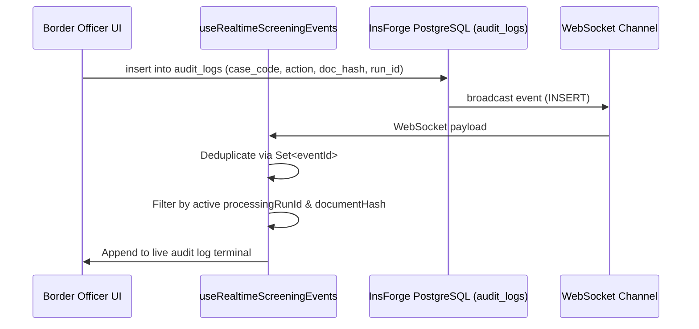

# TRUSTGATE AI BILLION — REAL-TIME AUDIT LOGGING & PUB/SUB
**Document Reference**: `REALTIME_AUDIT.md`  
**Backend**: InsForge PostgreSQL (PostgREST API + WebSocket Pub/Sub)  
**Database URL**: `https://heicn84u.us-east.insforge.app`  
**Implementation**: `src/hooks/useRealtimeScreeningEvents.ts`, `src/lib/db.ts`  

---

## 1. Pub/Sub Architecture

All border gateway actions (officer decisions, automated pipeline executions, watchlist hits, and hardware errors) are replicated in real-time to InsForge PostgreSQL.



---

## 2. Event Deduplication & Concurrency Scoping

To eliminate duplicate event logging and avoid stale data leakages:
1. **Set<eventId> Deduplication**: The hook maintains an in-memory hash set of received event IDs. Duplicate event packets are discarded in $O(1)$ time.
2. **Processing Run Scoping**: Events emitted by concurrent or previous inspection sessions are filtered:
   ```typescript
   if (processingRunId && event.processingRunId && event.processingRunId !== processingRunId) {
     return; // Discard stale session event
   }
   ```
3. **Unmount Cleanup**: All WebSocket subscriptions are closed synchronously upon component unmount.
