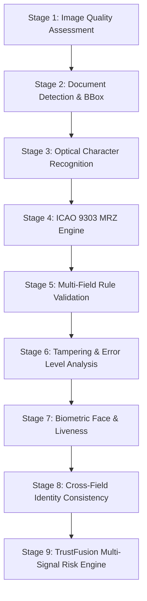

# TRUSTGATE AI BILLION — 9-STAGE DEEP FORENSIC SCREENING PIPELINE
**Document Reference**: `SCREENING_PIPELINE.md`  
**Standard**: ICAO Doc 9303 / BSI TR-03105 / ISO/IEC 19794  
**Orchestration**: `src/ai/pipeline/orchestrator.ts`  
**Execution Latency**: 800ms – 1,400ms (Local In-Browser & Local Python)  

---

## 1. The 9-Stage Forensic Hierarchy

Every document ingested into TrustGate AI traverses 9 isolated forensic stages in strict topological sequence:

---

## 2. Failure-Safe Execution Matrix

| Stage | Input Required | Output on Success | Output on Missing / Failure | Zero-Mock Rule |
| :--- | :--- | :--- | :--- | :--- |
| **01 Quality** | Raw image bytes | Resolution, brightness, Laplacian blur variance | `POOR_QUALITY` / `RECAPTURE_REQUIRED` | Never force-pass blurred image |
| **02 Detection** | Normalized canvas | Aspect ratio, standard, crop coordinates | `UNKNOWN_DOCUMENT` ($le 0.35$) | Never default to passport |
| **03 OCR** | Image crop | Extracted text, field bounding boxes | `AWAITING_DOCUMENT_INGESTION` | Never inject demo names/dates |
| **04 MRZ** | High-res crop | Extracted lines, check digits, validity | `NOT_PRESENT` / `CHECKSUM_FAILED` | Check digits calculated via 7-3-1 |
| **05 Validation** | OCR + MRZ fields | Expiry rules, date order, renewal status | `REVIEW_REQUIRED` | Strict UTC border clock check |
| **06 Tampering** | Raw image bytes | ELA variance, clone artifacts, splice regions| `NO_EVIDENCE_DETECTED` / `SUSPICIOUS`| Real recompression difference |
| **07 Face** | Document + Camera | Face crop, liveness, embedding match | `NOT_AVAILABLE` / `NO_FACE_DETECTED` | Never fabricate match score |
| **08 Identity** | Verified fields | Law enforcement database match status | `NO_RECORD_FOUND` / `UNAVAILABLE` | No record found $\ne$ automatic fraud |
| **09 Fusion** | All active signals | Composite Risk (0-100), AI Confidence, Decision | `INCONCLUSIVE` / `REVIEW_REQUIRED` | Risk score $\ne$ AI confidence |
