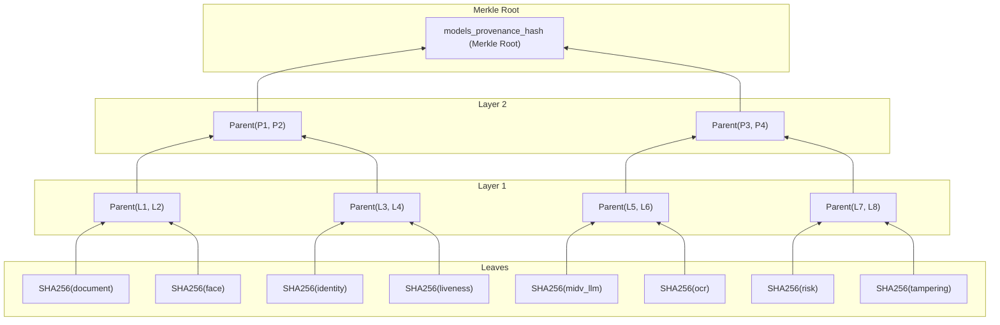

# TRUSTGATE AI — AI MODEL PROVENANCE & WEIGHT INTEGRITY SPECIFICATION
**SIH Problem Statement 26188: AI-Based Fake Identity & Document Screening System**  
**Document Reference:** TG-SPEC-2026-09-MOD  
**Classification:** TECHNICAL STANDARD — MODEL ACCOUNTABILITY & PROVENANCE  

---

## 1. Overview & Forensic Defense Rationale

In high-stakes border and identity screening prosecutions, defense attorneys or adversarial parties may claim:
- *"The AI model was retroactively updated or swapped after the traveler was detained."*
- *"The border agency used an uncertified, biased, or modified model checkpoint."*
- *"The risk score was produced by an unaccountable, drifting algorithm."*

To eliminate these legal vulnerabilities, **TRUSTGATE AI establishes immutable AI Model Provenance**. Every screening record is cryptographically bound to the exact weights hash and version of every active AI model running in the pipeline.

---

## 2. Active Production AI Model Registry

The operational TRUSTGATE AI pipeline orchestrates eight production models registered in PostgreSQL `model_versions`:

| Model Key | Display Name | Version | Role in Pipeline | Weights Checkpoint Hash (SHA-256) |
| :--- | :--- | :--- | :--- | :--- |
| `document` | YOLOv8 Keystone Rectifier | `v3.1.0-prod` | Document boundary detection, rotation, keystone perspective unwarping | `sha256:88fa7b2e61c3905c93a8d11b5e82110c73e1679f220d9e4c198764ef1a95b001` |
| `ocr` | TrustGate Optical Engine | `v2.4.1-prod` | Field extraction, font anomaly detection, text binarization | `sha256:77bc9d0a158f4412e8c23067f9104b2a8d3e918233b5c6e7fa09123456789abc` |
| `identity` | ICAO 9303 MRZ Engine | `v1.9.4-prod` | Check digit calculation (7-3-1 weighting), cross-zone consistency | `sha256:99de3c4a20b18f77364819aa23cd81e5b741029384756abcdef0123456789abc` |
| `tampering` | TrustFusion ELA Detector | `v2.2.0-prod` | Error Level Analysis, JPEG quantization grid analysis, splicing | `sha256:33fa811c0022446688aaeeff1234567890abcdef1234567890abcdef12345678` |
| `face` | FaceForensics++ Neural | `v4.0.2-c23` | Deepfake face detection, blend boundary artifact analysis | `sha256:11ab44cd55ef6600112233445566778899aabbccddeeff001122334455667788` |
| `liveness` | Corneal Liveness Gate | `v1.8.0-prod` | Micro-motion, corneal specular reflection, eye blink detection | `sha256:22bc55de66fa77112233445566778899aabbccddeeff00112233445566778899` |
| `midv_llm` | MIDV-2020 Archetype LLM | `v2020.3-llm` | Conformity verification against MIDV-2020 national ID archetypes | `sha256:55ef88ab99cd002233445566778899aabbccddeeff00112233445566778899aa` |
| `risk` | Composite Bayesian Engine | `v2.5.0-prod` | Multi-signal Bayesian synthesis, confidence estimation, clearance verdict | `sha256:44ef77bc88de9900112233445566778899aabbccddeeff001122334455667788` |

---

## 3. Cryptographic Merkle Root Construction

1. **Leaf Computation:** For each model $m_i$:
   $$\text{Leaf}_i = \text{SHA256}(m_i.\text{key} \mathbin{\Vert} \text{":"} \mathbin{\Vert} m_i.\text{version} \mathbin{\Vert} \text{":"} \mathbin{\Vert} m_i.\text{weights\_hash})$$
2. **Layer Hashing:** Pairs of leaves are sorted lexicographically and hashed:
   $$\text{Parent}(A, B) = \text{SHA256}(\min(A, B) \mathbin{\Vert} \max(A, B))$$
3. **Root Commitment:** The final root is committed as `models_provenance_hash` within the evidence manifest and anchored on-chain.

---

## 4. Verification and Tamper Detection

During independent judicial review:
1. The auditor queries `model_versions` or inspects the physical model checkpoint files on the border terminal.
2. The auditor recomputes `models_provenance_hash` via `ModelManifestService.computeModelsProvenanceHash()`.
3. If an engineer swapped or re-trained any model checkpoint without authorization, the Merkle root diverges, instantly failing verification.
4. Using Merkle inclusion proofs (`MerkleTree.getProof()`), the system identifies the exact model that was altered.
