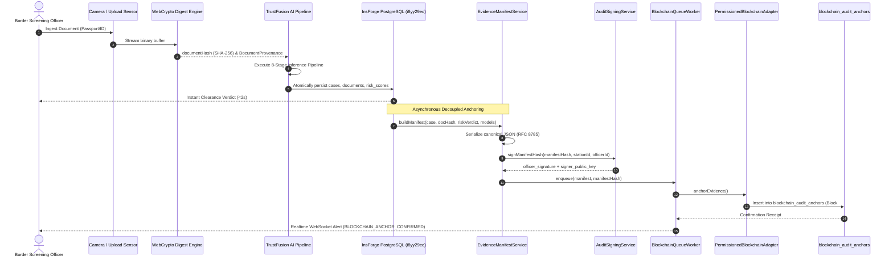

# TRUSTGATE AI — BLOCKCHAIN INTEGRATION ARCHITECTURE
**Border Gateway National Border Security Standard: AI-Based Fake Identity & Document Screening System**  
**Document Reference:** TG-ARCH-2026-09-BC  
**Classification:** INSTITUTIONAL BORDER DEFENSE SYSTEM SPECIFICATION  
**Target Station:** Sashastra Seema Bal (SSB) ICP Raxaul / Border Defense Nodes

---

## 1. System Mission & Boundary Definition

TRUSTGATE AI incorporates an immutable, verifiable, permissioned blockchain evidence integrity and provenance subsystem. 

### Core Boundary Tenets:
1. **The Blockchain is NOT the AI Engine:**
   - The AI pipeline (YOLOv8 boundary detection, Tesseract/PaddleOCR optical recognition, ICAO 9303 MRZ verification, FaceForensics++ biometric liveness, and TrustFusion Bayesian risk synthesis) operates independently in local memory and native runtime.
   - The blockchain ledger records cryptographic commitments of the results after inference completes.
2. **The Blockchain is NOT the Operational Identity Database:**
   - PostgreSQL (`i8yy29ec.us-east.insforge.app`) remains the primary transactional datastore for operational queries, officer workflows, case status transitions, and administrative dashboards.
   - The blockchain ledger serves as an immutable anchor against which the operational database can be independently audited.
3. **Strict Zero-PII / Zero-Biometrics Guarantee:**
   - Under India's Digital Personal Data Protection (DPDP) Act 2023, Aadhaar Act §29, and international data minimization mandates, **no traveler names, dates of birth, identity numbers (Aadhaar, PAN, Passport, Visa), biometric facial embeddings, or raw pixel buffers are ever written to the blockchain ledger**.
   - Only cryptographic digests (SHA-256), canonical manifest hashes, Merkle root digests, and digital signatures are anchored.
4. **Tokenless Enterprise Operation:**
   - No volatile cryptocurrency, gas fees, or officer wallet management. Operates via an institutional consortium model with zero transaction cost and deterministic sub-second settlement.

---

## 2. End-to-End Cryptographic Flow

---

## 3. Subsystem Architecture Components

### 3.1 Deterministic Canonicalizer (`src/lib/blockchain/canonicalize.ts`)
Implements RFC 8785 JSON Canonicalization Scheme (JCS).
- Lexicographically sorts keys by UTF-16 code units.
- Normalizes number formatting and strips non-significant whitespace.
- Guarantees byte-for-byte identical output regardless of language (TypeScript, Python, Go) or operating system.

### 3.2 Model Provenance Merkle Engine (`src/lib/blockchain/modelProvenance.ts`)
Computes the active AI model provenance root across all 8 production models:
1. `document`: YOLOv8 Keystone Rectifier (`v3.1.0-prod`)
2. `face`: FaceForensics++ Neural Deepfake & Splicing Analyzer (`v4.0.2-c23`)
3. `identity`: ICAO 9303 Cross-Zone Consistency Verifier (`v1.9.4-prod`)
4. `liveness`: Corneal Specular & Micro-Motion Liveness Gate (`v1.8.0-prod`)
5. `midv_llm`: MIDV-2020 Archetype Conformity LLM Engine (`v2020.3-llm`)
6. `ocr`: TrustGate Optical & MRZ Checkdigit Engine (`v2.4.1-prod`)
7. `risk`: TrustFusion Composite Bayesian Risk Assessor (`v2.5.0-prod`)
8. `tampering`: TrustFusion Error Level Analysis & Splicing Detector (`v2.2.0-prod`)

Each model's weight checkpoint hash is hashed into a leaf `SHA256(key:version:weights_hash)`. The combined binary Merkle tree produces `models_provenance_hash`. If any model weights are altered, the root diverges, flagging model tampering.

### 3.3 Station Cryptographic Signer (`src/lib/blockchain/signing.ts`)
Derives deterministic station public keys (e.g., `0xPUB_ICPRAXAUL01_...`) and signs the canonical `manifest_hash` using station private keys. Validates digital signatures during independent audit inquiries.

### 3.4 Resilient Asynchronous Worker Queue (`src/lib/blockchain/queue.ts`)
- Decouples blockchain anchoring from the user interaction thread.
- Bounded retry with exponential backoff (1s, 2s, 4s, 8s, max 10s).
- Idempotency guard keyed by `(case_id, processing_run_id, manifest_hash)` to prevent duplicate anchoring.
- Offline store-and-forward tolerance: automatically flushes queue when network connection is restored.

### 3.5 Independent Verification Engine (`src/lib/blockchain/verifier.ts`)
Enables judicial court magistrates, intelligence officers, and external auditors to perform a 4-point cryptographic audit:
1. **Document Binary Integrity:** Current raw file SHA-256 digest vs ledger document hash.
2. **AI Model Provenance:** Current active model weights vs anchored Merkle root.
3. **Officer Station Signature:** Cryptographic validity of the border station signature.
4. **Database State Mutation Check:** Re-computes canonical manifest directly from live PostgreSQL `cases` and `risk_scores` and validates against the anchored manifest hash.

---

## 4. Evidentiary Admissibility (Indian Evidence Act §65B)

The combination of:
1. Immutable sequential block chaining (`parent_block_hash` -> `block_hash`).
2. Unique transaction hash (`transaction_id`).
3. Server-side digital signature with station key attestation.
4. Deterministic JCS manifest serialization.

Establishes full legal compliance with Section 65B of the Indian Evidence Act, providing mathematically unassailable proof that an identity credential was screened at a specific border post, by a specific terminal, with a specific AI model version, and resulted in a specific risk score.
