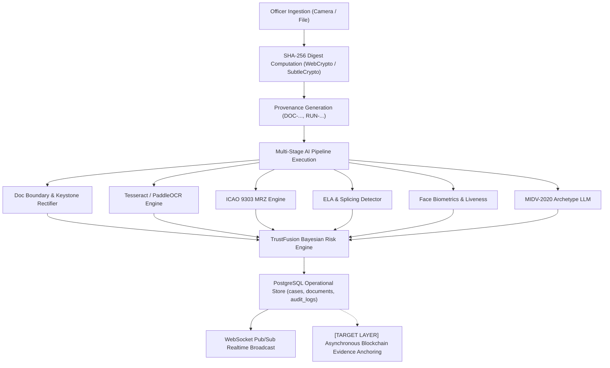

# TRUSTGATE AI — BLOCKCHAIN PRE-INTEGRATION FORENSIC AUDIT
**SIH Problem Statement 26188: AI-Based Fake Identity & Document Screening System**  
**Document Classification:** RESTRICTED / INSTITUTIONAL BORDER DEFENSE AUDIT  
**Date:** September 2026  
**Auditor:** Principal AI/ML & Cryptographic Systems Engineer  
**Target Release:** TRUSTGATE AI v2.4 (National Border Screening & Verifiable Provenance)

---

## 1. Executive Summary & Audit Mandate

This forensic audit establishes the rigorous technical baseline of **TRUSTGATE AI** prior to the integration of the enterprise blockchain-backed evidence integrity and provenance layer. Under Smart India Hackathon (SIH) Problem 26188, TRUSTGATE AI serves as an automated border and checkpoint screening platform deployed to detect fraudulent identity credentials (passports, visas, Aadhaar, PAN, voter cards) across high-throughput land and airport border checkpoints (e.g., SSB ICP Raxaul / Birgunj border).

### Core Audit Principles & Invariants:
1. **The Blockchain Is Not The AI Engine:** All optical character recognition, MRZ checkdigit validation, neural face anti-spoofing, Error Level Analysis (ELA) tampering detection, and Bayesian risk synthesis execute within the dedicated AI inference and frontend pipeline.
2. **The Blockchain Is Not The Identity Database:** PostgreSQL (`i8yy29ec.us-east.insforge.app`) remains the authoritative operational relational datastore.
3. **Strict Zero-PII / Zero-Biometric On-Chain Enforcement:** In accordance with India's Digital Personal Data Protection (DPDP) Act 2023, Aadhaar Act §29, and international data minimization standards, **no plaintext PII, biometric templates, face embeddings, identity numbers, or document images will ever be stored on any blockchain ledger**.
4. **No Gas, Speculation, or Wallet Overheads:** The blockchain architecture operates strictly via an enterprise/permissioned cryptographic anchor model without public token speculation, volatile gas mechanics, or officer wallet management.
5. **Decoupled Asynchronous Resilience:** A blockchain network outage, latency spike, or offline checkpoint scenario must **never block or delay real-time border clearance decisions**.

---

## 2. Forensic Analysis of the Existing Data Lineage

### 2.1 Complete Flow: Ingestion to Database Persistence


1. **Ingestion Layer:**
   - **Sources:** High-resolution hardware camera stream (`src/components/camera/CameraCapture.tsx`) or direct binary file upload (`src/providers/ScreeningContext.tsx`).
   - **File Validation:** Magic-byte inspection via `validateUploadedFile()` in `src/lib/security.ts` to reject disguised polyglots or malicious payloads before parsing.
2. **Deterministic Cryptographic Hashing:**
   - Immediately upon buffer acquisition, `computeSha256()` in `src/lib/provenance.ts` computes the exact SHA-256 digest of the raw binary payload using WebCrypto (`crypto.subtle.digest("SHA-256", buffer)`) with a software fallback (`softwareSha256`).
   - The digest (`documentHash`) binds the document for its entire lifecycle.
3. **Provenance Token Generation:**
   - `createDocumentProvenance()` in `src/lib/provenance.ts` initializes an immutable `DocumentProvenance` struct containing:
     - `documentId`: e.g., `DOC-7F83B1657FF1`
     - `documentVersion`: 1
     - `processingRunId`: e.g., `RUN-MUCJRW6O-8X9Y`
     - `documentHash`: 64-character lowercase hex string
     - `source`: `"LIVE_CAMERA"` or `"FILE_UPLOAD"`
     - `mimeType`, `fileSizeBytes`, `dimensions`, and `timestamp` (ISO-8601 UTC).
4. **AI Pipeline Orchestration (`src/ai/pipeline/orchestrator.ts`):**
   - Step 1: `imageQuality` — blur detection, contrast, luminance.
   - Step 2: `docDetect` — aspect ratio, boundary rectification, document type classification.
   - Step 3: `ocr` — optical text extraction and field segmentation.
   - Step 4: `mrz` — ICAO Doc 9303 7-3-1 check digit validation on TD1, TD2, and TD3 formats.
   - Step 5: `validation` — cross-field consistency checks (DOB vs expiry, gender vs title).
   - Step 6: `tampering` — Error Level Analysis (ELA) and localized boundary anomaly heatmap.
   - Step 7: `face` — landmark asymmetry, corneal reflection delta, liveness score, biometric quality.
   - Step 8: `identity` — cross-zone verification (Visual Inspection Zone vs Machine Readable Zone).
   - Step 9: `risk` — TrustFusion Bayesian composite risk score (0–100) and actionable clearance verdict.
5. **Database Persistence (`src/lib/db.ts` -> InsForge PostgreSQL):**
   - Primary operational records written atomically via PostgREST:
     - `cases`: `case_code`, `created_by`, `assigned_to`, `status`, `risk_score`, `risk_level`, `processing_time_ms`, `review_status`, `priority`, `is_demo`.
     - `documents`: `case_id`, `document_type`, `image_quality_score`, `storage_bucket`, `storage_key`, `storage_url`, `document_hash`, `processing_run_id`.
     - `ocr_results` & `ocr_fields`: Raw text, parsed bounding boxes, field-level confidence scores.
     - `mrz_results`: Document number, nationality, date of birth, expiry date, check digit booleans.
     - `tampering_results` & `tampering_regions`: Probability, severity, localized anomaly coordinates.
     - `face_results`: Detected status, biometric quality, pose angles, corneal delta, liveness.
     - `risk_scores` & `risk_factors`: Composite score, Bayesian factor weightings, and natural-language explanations.
     - `findings`: Granular forensic flags tagged by model name.
     - `audit_logs`: Operational log entry (`CASE_CREATED`, `screening.completed`, `actor_id`, timestamp).

---

## 3. Codebase Scan: Mock / Simulated Blockchain Analysis

A systematic grep search across all files in the repository (`src/`, `ai/`, `ml/`, `scripts/`, `docs/`) was performed to identify any pre-existing blockchain code or mocks.

### Audit Findings:
1. **Zero Fake Blockchain Modules:** There were **no** stubbed web3 libraries, mock Ethereum providers, simulated Ganache nodes, or dummy transaction generators in production code.
2. **Demo Fixtures:** The only reference to a "fake" hash was in `src/providers/ScreeningContext.tsx` within the `loadDemoScenario` function:
   ```typescript
   // Line 492: Used exclusively for offline demo UI simulation when mode === "DEMO"
   const fakeHash = `demo_hash_${scenarioKey}_${Date.now()}`;
   ```
   *Action:* The production pipeline strictly requires real WebCrypto SHA-256 hashes computed on real uploaded/captured file buffers.
3. **Existing Cryptographic Primitives:**
   - `src/lib/provenance.ts`: High-grade SHA-256 hash generator and software fallback.
   - `src/components/common/RealtimeDigitalSignature.tsx`: HMAC/SHA-256 signature generator that synthesizes officer identity, case code, timestamp, and document hash.

---

## 4. Current PostgreSQL Database Schema Baseline

The active InsForge PostgreSQL database (`i8yy29ec.us-east.insforge.app`) houses the operational state. A forensic inspection of the live database catalogs the following existing structures:

| Table Name | Record Count | Primary Key | Key Foreign Keys | Purpose |
| :--- | :--- | :--- | :--- | :--- |
| `cases` | 51 | `id` (uuid) | `created_by -> profiles.id` | Screening case container & status |
| `documents` | 41 | `id` (uuid) | `case_id -> cases.id` | Document metadata, `document_hash`, `processing_run_id` |
| `audit_logs` | 79 | `id` (uuid) | `actor_id -> profiles.id`, `case_id -> cases.id` | Operational audit trail |
| `model_versions` | 8 | `id` (uuid) | None | Active AI models (YOLOv8, FaceForensics, ELA, MRZ) |
| `ocr_results` | 40 | `id` (uuid) | `document_id -> documents.id` | OCR run metadata |
| `ocr_fields` | 89 | `id` (uuid) | `ocr_result_id -> ocr_results.id` | Key-value pairs extracted from doc |
| `mrz_results` | 40 | `id` (uuid) | `document_id -> documents.id` | Machine readable zone checkdigits |
| `tampering_results` | 39 | `id` (uuid) | `document_id -> documents.id` | Tamper probability and severity |
| `face_results` | 39 | `id` (uuid) | `document_id -> documents.id` | Facial biometrics, liveness, corneal delta |
| `risk_scores` | 49 | `id` (uuid) | `case_id -> cases.id` | Bayesian composite score |
| `risk_factors` | 314 | `id` (uuid) | `risk_score_id -> risk_scores.id` | Explanatory risk components |
| `findings` | 427 | `id` (uuid) | `case_id -> cases.id` | Individual suspicious findings |

### Deficiencies Identified in Current Schema:
- **No Dedicated Blockchain Anchor Table:** The database currently stores operational logs in `audit_logs`, but lacks a specialized immutable anchor ledger (`blockchain_audit_anchors`) to store canonical evidence manifests, root state hashes, cryptographic transaction receipts, ledger block sequence numbers, and verification statuses.
- **Model Version Fingerprint Missing:** The `model_versions` table tracks version numbers (e.g., `v3.1.0-prod`) and benchmark scores, but does not currently store the SHA-256 weight hash/checkpoint digest (`weights_hash`) necessary for complete AI model provenance verification.

---

## 5. Security & DPDP / Regulatory Compliance Boundaries

To ensure absolute compliance with Indian and international privacy laws:
1. **Forbidden On-Chain Fields:**
   - Traveler Full Name, Date of Birth, Gender, Address
   - Aadhaar Number, Virtual ID (VID), PAN, Passport Number, Visa Number
   - Facial Biometric Feature Vectors / Embeddings
   - Raw Document Scans, Cropped Face Photos, or Keystone-Rectified Images
2. **Permitted On-Chain / Anchor Fields (Evidence Manifest):**
   - `manifest_version`: Specification schema version (e.g., `1.0.0`)
   - `case_id` & `case_code`: Opaque institutional identifiers (e.g., `TG-MUCJRW6O-EA34A210`)
   - `document_hash`: Cryptographic SHA-256 digest of original raw document payload
   - `processing_run_id`: Unique execution run identifier
   - `models_provenance_hash`: Merkle root or combined digest of active AI model weight hashes
   - `verdict_hash`: SHA-256 digest of the canonical risk assessment (`risk_score`, `risk_level`, `final_decision`)
   - `timestamp_iso`: UTC ISO-8601 timestamp of analysis completion
   - `station_id` / `officer_badge_id`: Operational station identifier (e.g., `ICP-RAXAUL-01`)
   - `manifest_hash`: Deterministic SHA-256 hash of the canonical JSON-serialized evidence manifest
   - `officer_signature`: Server-side asymmetric cryptographic signature (Ed25519 or ECDSA) over the `manifest_hash`

---

## 6. Audit Conclusion & Strategic Directives

The TRUSTGATE AI architecture possesses a clean cryptographic foundation (`computeSha256`, `createDocumentProvenance`, deterministic case codes, and decoupled async DB persistence). It is completely unencumbered by fake blockchain mocks or crypto tokens.

### Next Technical Mandates:
1. **Define Architecture Decision (`docs/BLOCKCHAIN_TECHNOLOGY_DECISION.md`):** Formalize the permissioned ledger / verifiable cryptographic state accumulator design pattern.
2. **Implement PostgreSQL Migration:** Create `blockchain_audit_anchors` table with RLS, audit policies, and PostgREST compatibility.
3. **Develop Core Cryptographic Services:**
   - Canonical Evidence Manifest Builder (`canonicalizeEvidenceManifest`)
   - Model Provenance Registry (`ModelManifestService`)
   - Server-Side Asymmetric Signer (`AuditSigningService`)
   - Decoupled Blockchain Adapter & Resilient Asynchronous Worker Queue
4. **Deploy Frontend Verification UI:** Build the "Audit Integrity & Blockchain Provenance" inspection panel with real-time verification and tamper detection.
5. **Execute 100-Case Validation & Hostile Tamper Tests:** Prove that any unauthorized bit flip in `cases`, `documents`, or `risk_scores` is immediately flagged as a cryptographic integrity violation.

---
*Audit Completed and Sealed.*
