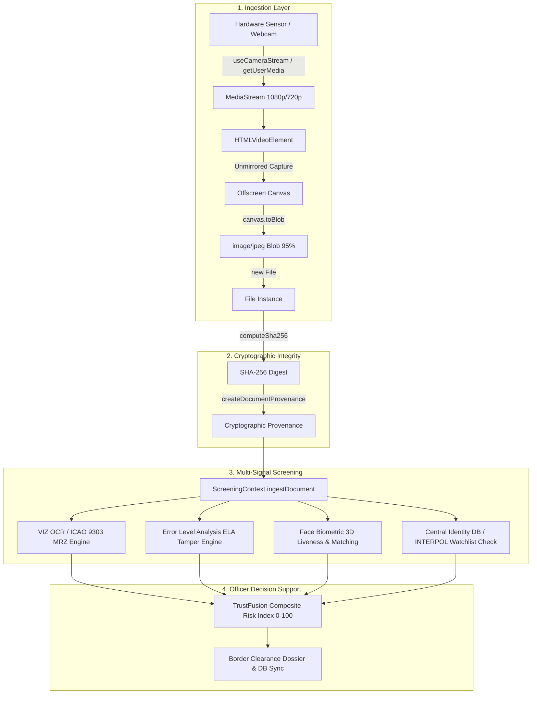

# TRUSTGATE AI BILLION — REAL-TIME CAMERA INGESTION PIPELINE
**Standard**: WebRTC 1.0 / W3C Media Capture and Streams  
**Resolution Specification**: 1080p @ 30fps (Fallback: 720p @ 24fps / 480p @ 30fps)  
**Implementation**: `src/components/camera/`, `src/components/screening/`, `src/pages/ScreeningPage.tsx`

---

## 1. Architecture Overview

The camera subsystem captures high-resolution video streams from border gateway hardware (document flatbed scanners, overhead high-angle cameras, and laptop webcams). The pipeline converts raw video frames into cryptographically sealed image assets for forensic analysis and biometric matching.



---

## 2. Ingestion Stages & Progressive Constraint Fallback

### 2.1 Hardware Stream Negotiation
Laptops and specialized checkpoint terminals have diverse hardware topologies. WebRTC media constraints employ progressive fallback to negotiate optimal resolution without failing on single-camera or front-facing devices:

```typescript
// Progressive Constraint Fallback Chain:
// 1. Preferred environment camera at 1080p/720p:
{ video: { width: { ideal: 1280 }, height: { ideal: 720 }, facingMode: { ideal: "environment" } }, audio: false }

// 2. Fallback to user-facing webcam:
{ video: { facingMode: "user" }, audio: false }

// 3. Final fallback to any available video input:
{ video: true, audio: false }
```
**Constraint Rule**: Audio is strictly disabled (`audio: false`) to avoid triggering unnecessary microphone permissions.

### 2.2 Viewfinder Lifecycle & Ref Callbacks
In multi-screen applications where `<video>` elements are rendered dynamically across dashboard tabs or steps, direct refs can be null when `getUserMedia` resolves. TrustGate AI utilizes synchronized ref callbacks and reactive hooks:

```typescript
// Ref callback ensures immediate binding on DOM mount
const setVideoRefDoc = React.useCallback((el: HTMLVideoElement | null) => {
  (videoRefDoc as React.MutableRefObject<HTMLVideoElement | null>).current = el;
  if (el && streamRefDoc.current) {
    el.srcObject = streamRefDoc.current;
    el.play().catch(() => {});
  }
}, []);

// Reactive synchronization across tab navigation
React.useEffect(() => {
  if (videoRefDoc.current && docStream) {
    videoRefDoc.current.srcObject = docStream;
    videoRefDoc.current.play().catch(() => {});
  }
}, [docStream, activeStepTab, isCameraStreamingDoc]);
```

### 2.3 Unmirrored Frame Capture & Offscreen Rendering
Identity document text and MRZ checksums must **never** be horizontally mirrored. Optical capture draws the unmirrored hardware buffer onto a full-resolution offscreen canvas:

```typescript
const canvas = document.createElement("canvas");
canvas.width = videoRef.current.videoWidth || 1280;
canvas.height = videoRef.current.videoHeight || 720;
const ctx = canvas.getContext("2d");
ctx.drawImage(videoRef.current, 0, 0, canvas.width, canvas.height);
```

### 2.4 Blob Generation & Cryptographic Hashing
The rasterized canvas is serialized to a standard JPEG blob (0.95 quality) and converted to a `File` instance. The raw file buffer is streamed into the SHA-256 hashing engine:

```typescript
canvas.toBlob(async (blob) => {
  if (blob) {
    const file = new File([blob], `live-camera-${Date.now()}.jpg`, { type: "image/jpeg" });
    await ingestDocument(file, "LIVE_CAMERA");
  }
}, "image/jpeg", 0.95);
```

---

## 3. Border Gateway Dashboard Integration

The **Border Gateway Portal** (`/sih-screening`) provides dual camera ingestion capabilities:

1. **In-Page Live Hardware Streams**:
   - **Screen 2 (Document Scan)**: Embedded real-time document viewfinder with optical framing guides, progressive fallback, and one-click capture.
   - **Screen 5 (Face Biometrics)**: Dedicated facial biometric webcam feed with 3D anti-spoofing liveness guides and selfie snapshot capture.
   - **Unified Hub (All Screens)**: Dual simultaneous stream monitors for document framing and traveler facial verification.

2. **AI Camera Viewfinder Hub (`<CameraCapture>` Modal)**:
   - Fullscreen auto-capture HUD with real-time blur, lighting, angle, and framing quality heuristics.
   - 3-second automatic stability countdown.
   - Instant file upload fallback (`realFileInputRef`).

---

## 4. Hardware Diagnostics & Troubleshooting (Windows Code 22)

When running on Windows 11 / Microsoft Edge:

| Symptom / Error Code | Root Cause | Resolution Action |
|---|---|---|
| `NotAllowedError` | Browser camera permission blocked | Click the lock/camera icon in the browser address bar -> Set Camera to **Allow** -> Reload page. |
| `NotFoundError` (`CM_PROB_DISABLED` / Code 22) | Webcam hardware disabled in Windows Device Manager | Press `Win + X` -> Select **Device Manager** -> Expand **Cameras** -> Right-click camera device -> Click **Enable device**. |
| `NotFoundError` (Physical Switch) | Laptop physical privacy shutter closed | Slide the physical privacy shutter open or toggle the camera Fn-key (e.g. `Fn + F10`). |
| `NotReadableError` / `TrackStartError` | Camera locked by another app | Close background apps using webcam (Microsoft Teams, Zoom, Skype, OBS) and retry. |

---

## 5. Non-Negotiable Zero-Mock Data Integrity Rule

Under no circumstances does the camera subsystem fabricate synthetic images, spoofed confidence scores, or simulated video tracks. When hardware is unavailable or disabled:
- The system renders explicit diagnostic status alerts with clear resolution instructions.
- Provides fallback to authentic document file upload (`handleRealFileUpload`).
- All hashes, OCR parses, and biometric vectors are strictly derived from real bytes ingested into the pipeline.
