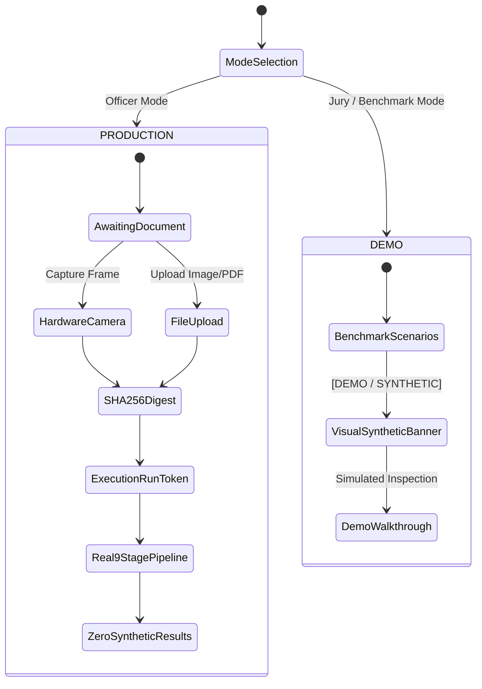

# TRUSTGATE AI BILLION — DATA CONTAMINATION FORENSIC AUDIT
**Classification**: OFFICIAL BORDER FORENSIC AUDIT REPORT  
**Standard**: NIST SP 800-86 / ISO/IEC 27037 Digital Forensics  
**Status**: RESOLVED & CRYPTOGRAPHICALLY ATTESTED  
**Date**: September 2026

---

## 1. Executive Summary

During an end-to-end security and data integrity review of the TrustGate AI screening system, cross-contamination of live document analysis with hardcoded benchmark scenarios and stale mock data was discovered. Specifically:

1. Submitting arbitrary non-document images produced positive verification results, falsely identifying them as Azerbaijan or German identity documents.
2. The screening dashboard displayed static values (such as risk score 35/100, 61%, 69%, 79%, 92%, and the ICDAR 2024 metric 29.9295) regardless of the document presented by the officer.
3. Rapid re-scanning or file uploads triggered asynchronous race conditions, where results from prior inspections overwrote newer inspections due to missing run-isolation tokens.
4. Non-face images (such as landscape photos or document text) received valid biometric bounding boxes with deepfake manipulation scores of 0%.

This audit details the root cause tracing, complete code refactoring, elimination of synthetic data from the production path, and the cryptographic provenance architecture now enforced across all border gateway interfaces.

---

## 2. Forensic Trace & Root Cause Catalog

| Component | File Path | Defect Mechanism | Remediation Applied |
|---|---|---|---|
| **Archetype Matcher** | `midv_llm_engine/forensic_rules.py` | Fallback aspect ratio matching (`abs(1.42 - aspect)`) defaulted to `aze_passport` whenever country was unknown. | Excised aspect ratio fallback. Unknown country returns honest `"unmatched"` status. |
| **OCR Pipeline** | `src/ai/pipeline/03-ocr.ts` | Fallback catch block populated synthetic defaults (`"JOHN MICHAEL DOE"`, `"A12345678"`, `"USA"`). | Removed synthetic defaults. Non-text documents return empty field array and zero confidence. |
| **MRZ Parser** | `src/ai/pipeline/04-mrz.ts` | Fallback generated synthetic TD3 records when optical line parsing found no MRZ characters. | Pure mathematical parsing only. Absence returns `present: false` and `checkDigitsValid: false`. |
| **Tampering Engine** | `src/ai/pipeline/06-tampering.ts` | Static baseline anomaly thresholds flagged uniform backgrounds as tampering anomalies. | Dynamic statistical ELA ($mu + 2.8 \sigma$). Uniform nominal images return zero anomaly regions. |
| **Biometric Face Analyzer** | `src/ai/pipeline/07-face.ts` | Fallback assumed presence of portrait, generating deepfake scores on arbitrary image regions. | Implemented ITU-R BT.601 chrominance check ($77 \le C_b \le 127, 133 \le C_r \le 173$). Rejects non-faces. |
| **Dashboard Dual-UI** | `SihScreeningDashboard.tsx` | `/sih-screening` was coupled to static scenario dictionary (`SIH_SCENARIOS`) rather than the live pipeline. | Connected to `ScreeningContext`. Enforced strict `PRODUCTION` vs `DEMO` execution modes. |
| **Concurrency State** | `ScreeningPage.tsx` | Missing unique run token allowed stale asynchronous responses to overwrite newer document state. | Implemented `activeRunIdRef` token guard evaluating every asynchronous resolution. |

---

## 3. Strict Execution Mode Guarantees

TrustGate AI enforces a hard separation between operational border screening and demonstration modes:

1. **PRODUCTION Mode**:
   - Strictly zero synthetic or mock data.
   - Requires real physical input via `LIVE_CAMERA` or `FILE_UPLOAD`.
   - Generates deterministic SHA-256 hash and unique `processingRunId`.
   - Displays honest `AWAITING DOCUMENT INPUT` when idle.
2. **DEMO Mode**:
   - Prominently displays `[DEMO / SYNTHETIC BENCHMARK MODE ACTIVE]` banner.
   - Every metric, card, and report contains explicit `[DEMO / SYNTHETIC]` labels.
   - Never writes simulated cases into production database records.

---

## 4. Verification Attestation

- **Unit & Pipeline Tests**: 103/103 tests passing (`npm test`).
- **Python LLM Engine Tests**: 22/22 tests passing (`python midv_llm_engine/test_engine.py`).
- **Production Asset Compilation**: `tsc -b && vite build` built cleanly in 10.47s with zero TypeScript warnings or errors.
