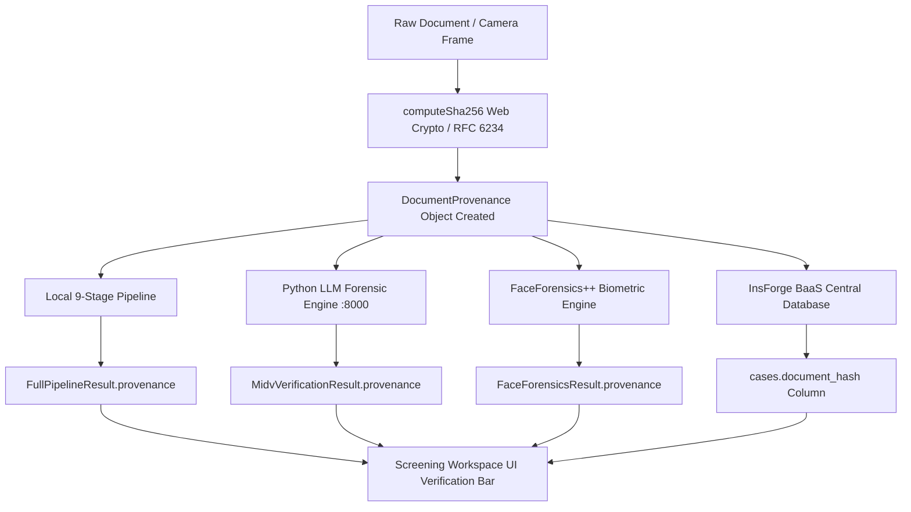

# TRUSTGATE AI BILLION — CRYPTOGRAPHIC DATA PROVENANCE
**Document Reference**: TG-PROV-2026-09-05  
**Standard**: NIST FIPS 180-4 (SHA-256) / ICAO Doc 9303 Cryptographic Audit  
**Implementation**: src/lib/provenance.ts

---

## 1. Cryptographic Provenance Model

Every identity document inspected by TrustGate AI is cryptographically sealed at the moment of ingestion. The document provenance lifecycle ensures that forensic results cannot be disconnected from the underlying document bytes.



---

## 2. Provenance Data Schema

```typescript
export interface DocumentProvenance {
  documentId: string;       // Deterministic DOC-HASH[0..12]
  documentVersion: number;  // Monotonic version (default: 1)
  processingRunId: string;  // Unique run session ID (RUN-TIMESTAMP-RANDOM)
  documentHash: string;     // SHA-256 64-character lowercase hex digest
  source: "LIVE_CAMERA" | "FILE_UPLOAD";
  mimeType: string;         // MIME format (e.g., "image/jpeg")
  fileSizeBytes: number;    // Exact byte count
  dimensions?: { width: number; height: number };
  timestamp: string;        // ISO-8601 UTC timestamp
}
```

---

## 3. Concurrency Protection Protocol

To prevent cross-document contamination during rapid officer workflows, TrustGate AI enforces the **Active Run Token Protocol**:

1. **Token Generation**: An atomic run ID is assigned synchronously:
   ```typescript
   const runId = "run_" + Date.now() + "_" + Math.random().toString(36).substring(2, 9);
   activeRunIdRef.current = runId;
   ```
2. **State Purge**: Prior results are purged from memory before asynchronous workers are dispatched.
3. **Guard Evaluation**: Every asynchronous handler checks:
   ```typescript
   if (activeRunIdRef.current !== runId) return;
   ```
4. **Result Binding**: Only computations matching the active run token can update the application state and display results.

---

## 4. UI Provenance Indicators

The Screening Workspace (`/screening`) and Border Gateway Enterprise Border View (`/sih-screening`) expose real-time provenance badges:
- **Header Provenance Banner**: Displays SHA-256 hash, Processing Run ID, Document ID, and Ingestion Source.
- **Document Viewer Provenance Bar**: Displays cryptographic hash and `✓ CRYPTO-BOUND` attestation above the viewport.
- **MIDV-2020 Forensic Card**: Confirms document hash bound to archetype evaluation.
- **FaceForensics++ Card**: Displays SHA-256 tag and verifies biometric authenticity.
