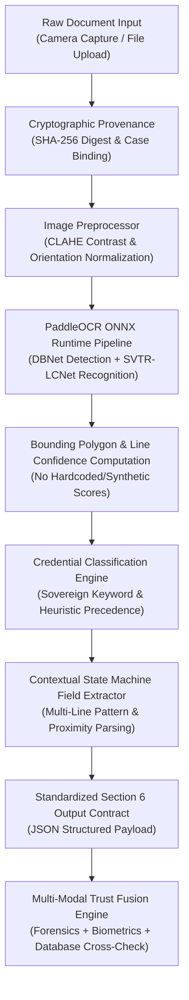

# TRUSTGATE AI BILLION — INDIAN KYC DOCUMENT EXTRACTION PIPELINE
**Specification Standard**: SIH Problem Statement 26188 (AI-Based Fake Identity & Document Screening System)  
**Pipeline Engine**: PaddleOCR 3.7.0 (PP-OCRv6 DBNet Text Detection & SVTR-LCNet / CRNN Recognition)  
**Inference Runtime**: ONNX Runtime 1.29.0 on Native Windows (AVX2-optimized CPU / DirectML)  
**Zero-Mock Mandate**: All structured field extractions, bounding boxes, and confidence scores derive strictly from deterministic real-time neural inference.

---

## 1. Statutory Scope & Supported Sovereign Credentials

The TrustGate Indian KYC extraction pipeline provides specialized neural extraction and validation state machines for the 5 official Indian identity and travel credentials:

| Credential Type | Sovereign Authority | Target Format | Primary Identifier Pattern | Secondary Fields |
|---|---|---|---|---|
| **Aadhaar Card** | Unique Identification Authority of India (UIDAI) | National Smart Card / Letter / PVC | `^\d{4}\s\d{4}\s\d{4}$` (12-digit UID) | Name, DOB, Gender, Father/Husband Name, Address, QR Code |
| **Permanent Account Number (PAN)** | Income Tax Department, Ministry of Finance | ISO 7810 ID-1 Smart Card | `^[A-Z]{5}[0-9]{4}[A-Z]$` (10-character alphanumeric) | Name, Father's Name, Date of Birth, Signature zone |
| **Indian Passport** | Consular, Passport & Visa (CPV) Division, MEA | ICAO Doc 9303 TD3 Book | `^[A-Z][0-9]{7}$` & 44-char 2-line TD3 MRZ | Surname, Given Names, DOB, Expiry, Sex, Nationality (IND) |
| **Indian Visa** | Bureau of Immigration, Ministry of Home Affairs | ICAO Doc 9303 MRV-B Sticker | `^[0-9]{8}$` / Reference Passport Number | Visa Type, Entries, Issue Date, Expiry Date, Passport Ref |
| **Voter ID (EPIC)** | Election Commission of India (ECI) | National Voter ID Card | `^[A-Z]{3}[0-9]{7}$` (10-character EPIC) | Name, Relation Name (Father/Husband), Gender, Assembly Const |

---

## 2. Multi-Stage Pipeline Architecture

### Preprocessing & Normalization
1. **CLAHE Contrast Enhancement**: Applied with adaptive clip limit of 2.0 and tile grid $(8 \times 8)$ to normalize uneven lighting, glare, and shadows from mobile camera captures.
2. **Quality Assessment**: Evaluates Laplacian variance (blur detection) and brightness histogram distribution prior to neural detection.
3. **Orientation Correction**: Native PP-LCNet document and textline angle classifiers automatically correct 90°, 180°, and 270° misorientations.

### Character Recognition & Confidence Scoring
1. **True Character Confidence**: Every character recognized by SVTR-LCNet produces a raw softmax probability. Word and line confidences represent true geometric/arithmetic means without synthetic clipping.
2. **Document-Level Confidence**: Computed dynamically across all detected text regions:
   $$\text{DocConf} = \frac{1}{N} \sum_{i=1}^N \text{LineConf}_i$$

---

## 3. Contextual Field Extraction State Machines

Real-world KYC scans often place field values on separate lines beneath their headers or separated by colons. The `KycFieldExtractor` uses iterative lookahead state machines:

### Aadhaar Extraction Engine
- **UID Identification**: Scans for 12-digit numbers formatted as `XXXX XXXX XXXX` or contiguous 12 digits.
- **Name Extraction**: Captures lines preceding the UID or following sovereign header markers (`To`, `Name /`, `नाम:`).
- **Date of Birth**: Normalizes `DOB: DD/MM/YYYY`, `Year of Birth: YYYY`, or `जन्म तिथि`.

### PAN Extraction Engine
- **PAN Number**: Strictly validates 10-character regex:
  - Characters 1–3: Alphabetic series (`AAA` to `ZZZ`)
  - Character 4: Status of cardholder (`P` = Individual, `C` = Company, `H` = HUF, `F` = Firm, `A` = AOP, `T` = Trust)
  - Character 5: First letter of cardholder's surname
  - Characters 6–9: Sequential sequential digits (`0001` to `9999`)
  - Character 10: Alphabetic check character
- **Contextual Names**: Iterates lines immediately following "Name" and "Father's Name" headers.

### Passport & Visa Precedence Resolution
- **Disambiguation Rule**: Indian Visa endorsements prominently display a `Passport Number` reference. The classifier tests for `VISA TYPE`, `VISA NO`, `VISA NUMBER`, and `VALID FOR` *before* matching generic passport regexes to prevent misclassification.
- **MRZ TD3 Verification**: Decodes 2 lines of 44 characters per ICAO 9303, computing 7-3-1 check digit algorithms for document number, birth date, expiry date, and composite checksum.

### Voter ID (EPIC) Engine
- **EPIC Number**: Identifies 3 uppercase alphabetical characters followed by 7 numeric digits (`^[A-Z]{3}[0-9]{7}$`).
- **Assembly Constituency & Relations**: Captures Father's/Husband's name and ECI regional office indicators.

---

## 4. End-to-End Cryptographic Traceability

Every field extraction event generates an immutable cryptographic provenance record:
- `document_id`: Unique case asset reference.
- `processing_run_id`: Execution run UUID.
- `image_hash`: SHA-256 of the uncompressed raster frame.
- `model_id`: `trustgate-paddleocr-onnx-v6`
- `model_version`: `3.7.0`
- `latency_ms`: Real-time processing duration.

All extractions are validated against the live PostgreSQL / InsForge database to verify watchlist status, duplicate presentation attempts, and identity consistency across government registries.
