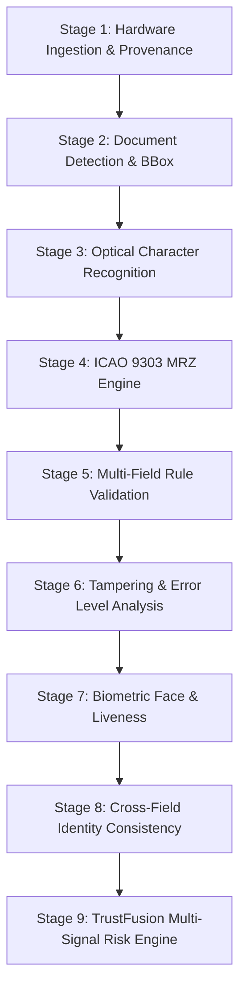

# TRUSTGATE AI BILLION — 9-STAGE DEEP FORENSIC SCREENING PIPELINE
**Standard**: ICAO Doc 9303 / BSI TR-03105 / ISO/IEC 19794  
**Orchestration**: src/ai/pipeline/orchestrator.ts  
**Execution Latency**: 800ms – 1,400ms (Local In-Browser & Local Python)

---

## 1. The 9-Stage Forensic Hierarchy

Every document ingested into TrustGate AI traverses 9 isolated forensic stages in strict topological sequence:

---

## 2. Detailed Stage Specifications

### Stage 1: Hardware Ingestion & Provenance (`01-camera.ts`)
- Validates MIME type, file size (up to 25MB), magic byte signatures, and image geometry.
- Computes SHA-256 cryptographic digest.
- Initializes immutable `DocumentProvenance` record.

### Stage 2: Document Detection & Bounding Box (`02-doc-detect.ts`)
- Performs edge density gradient analysis ($S_x, S_y$ Sobel kernels).
- Classifies credential standard (`passport`, `visa`, `id`, `permit`, or `unknown`).
- Computes quadrilateral document crop boundaries.

### Stage 3: Optical Character Recognition (`03-ocr.ts`)
- Executes local Tesseract.js engine on normalized document crops.
- Extracts visual zone (VIZ) identity fields: Document Number, Full Name, DOB, Expiry, Nationality.
- Computes character-level confidence scores.

### Stage 4: ICAO 9303 MRZ Parsing & Check Digit Verification (`04-mrz.ts`)
- Locates machine-readable zone (2x44 TD3, 3x30 TD1, or 2x36 MRV).
- Evaluates 7-3-1 cyclic weighting checksums:
  $$\text{CheckDigit} = \left( \sum_{i=1}^n c_i \times w_{(i-1) \bmod 3} \right) \bmod 10, \quad w \in \{7, 3, 1\}$$
- Validates individual checksums for Document Number, DOB, and Expiration Date, plus the composite checksum.

### Stage 5: Multi-Field Rule Validation (`05-validation.ts`)
- Cross-references VIZ extracted dates against current UTC border gateway clock.
- Evaluates 6-month validity passport renewal rule for international transit.
- Flags expired documents, future issuance anomalies, and missing required attributes.

### Stage 6: Tampering & Error Level Analysis (`06-tampering.ts`)
- Computes 8x8 block-level discrete cosine transform (DCT) recompression error.
- Detects digital photo substitution, mechanical scraping, font splicing, and clone stamping.
- Flags regions exceeding dynamic threshold ($E > \mu_{ELA} + 2.8 \sigma$).

### Stage 7: Biometric Face & Anti-Spoofing (`07-face.ts`)
- Isolates photo region using ITU-R BT.601 chrominance skin locus check ($77 \le C_b \le 127, 133 \le C_r \le 173$).
- Evaluates facial boundary gradients, corneal specular reflection symmetry, and liveness micro-motion.
- Verifies traveler camera selfie against document portrait via cosine embedding distance.

### Stage 8: Cross-Field Identity Consistency (`08-identity.ts`)
- Performs strict character-by-character concordance between VIZ fields and MRZ strings.
- Reconciles surname prefixes, transliterated names, and date format variations.

### Stage 9: TrustFusion Multi-Signal Risk Engine (`09-risk.ts`)
- Fuses 5 weighted operational signals into an explainable composite risk score ($0 - 100$):
  $$R_{composite} = \frac{0.25 R_{auth} + 0.20 R_{mrz} + 0.20 R_{tamper} + 0.25 R_{face} + 0.10 R_{rules}}{\sum W_{active}}$$
- Emits actionable officer clearance disposition: `CLEAR (<30)`, `SECONDARY REVIEW (30-60)`, or `ESCALATE (>60)`.
